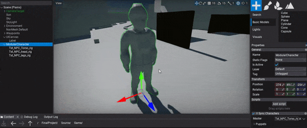

# Animated Model


**Animated Model** is an actor type that performs an animation and renders a skinned model.
It uses an animation graph instance to evaluate the skinned model bone transformations.

Before you can use animated model in your game you will need to import a [Skinned Model](skinned-model/index.md) and create an [Anim Graph](anim-graph/index.md).

## Usage

To learn how to setup and use the animated model please see the dedicated tutorials: [How to setup animated model](tutorials/setup-animated-model.md) and [How to change Anim Graph parameter from code](tutorials/change-anim-graph-param.md).

## Scripting

Animated Model actor exposes a rich C# scripting API. You can modify the anim graph instanced parameters values via [AnimatedModel.Parameters](https://docs.flaxengine.com/api/FlaxEngine.AnimatedModel.html#FlaxEngine_AnimatedModel_Parameters), modify rendered model meshes materials via [AnimatedModel.Entries](https://docs.flaxengine.com/api/FlaxEngine.AnimatedModel.html#FlaxEngine_AnimatedModel_Entries), gather the current skeleton bones pose via [AnimatedModel.GetCurrentPose](https://docs.flaxengine.com/api/FlaxEngine.AnimatedModel.html#FlaxEngine_AnimatedModel_GetCurrentPose_FlaxEngine_AnimatedModel_Pose__), or even manually update animation via [AnimatedModel.UpdateAnimation](https://docs.flaxengine.com/api/FlaxEngine.AnimatedModel.html#FlaxEngine_AnimatedModel_UpdateAnimation).

## Modular Characters



When working with highly customziable characters it's an often practise to split the skinned model into modular parts that use the same skeleton. This allows to build customziable characters (eg. custom player skins or randomized enemies look). Animated Model contains support for linking to other instance for skeleton pose copying instead of evaluating it again. Use `SetMasterPoseModel` method to create such linking as shown in a example script below:

```cs
using FlaxEngine;

/// <summary>Modular character setup script.</summary>
public class ModularCharacter : Script
{
    public AnimatedModel Master;
    public AnimatedModel[] Puppets;

    /// <inheritdoc/>
    public override void OnStart()
    {
        if (Master == null || Puppets == null)
            return;
        foreach (var e in Puppets)
            e.SetMasterPoseModel(Master);
    }
}
```

## Properties


| Property | Description |
|--------|--------|
| **Skinned Model** | Skinned model asset used for rendering. |
| **Animation Graph** | Animation graph used for the skinned mesh skeleton bones evaluation. |
| **Per Bone Motion Blur** | If checked, use per-bone motion blur on this skeletal model. It requires additional rendering, can be disabled to save performance. |
| **Use Time Scale** | If checked, animation speed will be affected by the global time scale parameter. |
| **Update When Offscreen** | If checked, the animation will be updated even when an actor cannot be seen by any camera. Otherwise, the animations themselves will also stop running when the actor is off - screen. |
| **Update Mode** | The animation update mode. Can be used to optimize the performance. Possible options: <table><tbody><tr><th>Option</th><th>Description</th></tr><tr><td>**Auto**</td><td>The automatic updates will be used (based on platform capabilities, distance to the player, etc.).</td></tr><tr><td>**Every Update**</td><td>Animation will be updated every game update.</td></tr><tr><td>**Every Second Update**</td><td>Animation will be updated every second game update.</td></tr><tr><td>**Every Fourth Update**</td><td>Animation will be updated every fourth game update.</td></tr><tr><td>**Manual**</td><td>Animation can be updated manually by the user scripts. Use AnimatedModel.UpdateAnimation() method.</td></tr><tr><td>**Never**</td><td>Animation won't be updated at all.</td></tr></tbody></table>|
| **Bounds Scale** | Master scale parameter for the actor bounding box. Helps reducing mesh flickering effect on screen edges. |
| **Custom Bounds** | Custom bounds (in actor local space). If set to empty bounds then source skinned model bind pose bounds will be used. |
| **Shadows Mode** | Shadows casting mode by meshes using this entry. Possible options: <br><table><tbody><tr><th>Option</th><th>Description</th></tr><tr><td>**None**</td><td>Never render shadows.</td></tr><tr><td>**Static Only**</td><td>Render shadows only in static views (env probes, lightmaps, etc.).</td></tr><tr><td>**Dynamic Only**</td><td>Render shadows only in dynamic views (game, editor, etc.).</td></tr><tr><td>**All**</td><td>Always render shadows.</td></tr></tbody></table> |
| **Root Motion Target** | Animation root motion apply target. If not specified the animated model will apply it itself. |

