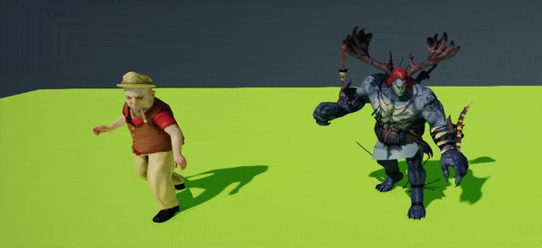
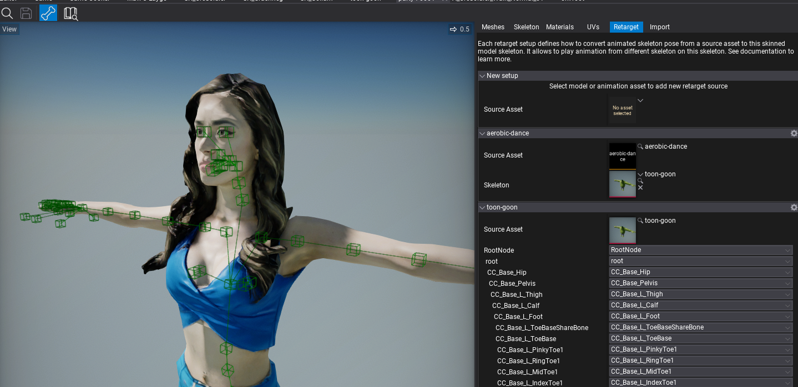
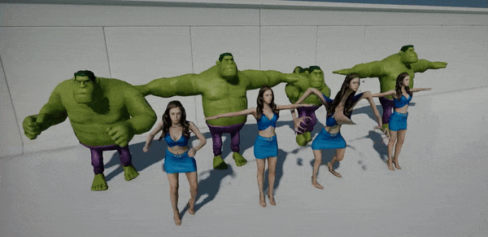

# Animation Retargeting

Animation Retargeting is a feature that allows **playing the same animation on different skeletons**. This can be useful when developing larger games where animations sharing helps reduce both development time and game build size.

Flax allows to play any [animation](../animation/index.md) on any [animated model](../animated-model.md) with automatic skeleton pose targeting.

## Default Skeleton Mapping

By default, the engine tries to match nodes between different **skeleton nodes by name (case-insensitive)**. On gif above you can see the same [Mixamo](https://www.mixamo.com/) animation with [Anim Graph](../anim-graph/index.md) created for the character on the left. Character on the right has a similar but not the same skeleton (has a few additional nodes and different proportions) and plays the same animation graph. Flax maps the skeleton nodes by name and includes reference-pose proportions scaling.

## Custom Skeleton Mapping

[Skinned Model window](../skinned-model/index.md) contains **Retarget** tab that displays a list of existing retargeting setups in the asset. It allows to add new ones for an animation or other skinned model's skeleton.

To add animation mapping select the source asset under *New setup* group panel. For example, pick an animation asset you want to retarget, then select a skeleton for that animation which should be a skinned model with the skeleton from that animation. It can be a character for which the animation was created or a skinned model imported from that animation source asset (skeleton-only without geometry). Then add *New setup* for that skinned model and adjust the skeleton bones mapping. By default, the Editor will guess the bones by name.

Skinned models can have any amount of setups created for different skeletons and animations from the projects which are played on this model. By using a settings button you can clear or remove a setup.

## Retargeting

| Before | After |
|--------|--------|
|  |  |

The animations retargeting system uses the reference pose of the source skeleton (known as *T-pose* or *A-pose*) to calculate the animated node motion relative to that ref pose. Then this motion is transformed into the target skeleton and applied. This assumes the animation is being played proportionally to the skeleton hierarchy and thus looks proper. Above, on the left gif, you can see 4 pairs of characters that are playing the same animation but created for different skeletons. After retargeting is applied the animations pose is properly applied as shown on the right gif.

### Tips

- Use the same T-Pose or A-Pose for both animation skeleton and target model pose so retargeting can work properly (eg. use Import Rotation on the imported model and animation to match the source and target skeletons)
- If you have only animation file you can import it as Animation and then as Skinned Model to use its skeleton for retargeting (Skinned Model doesn't need to have geometry as it can be skeleton-only container for retargeting)
