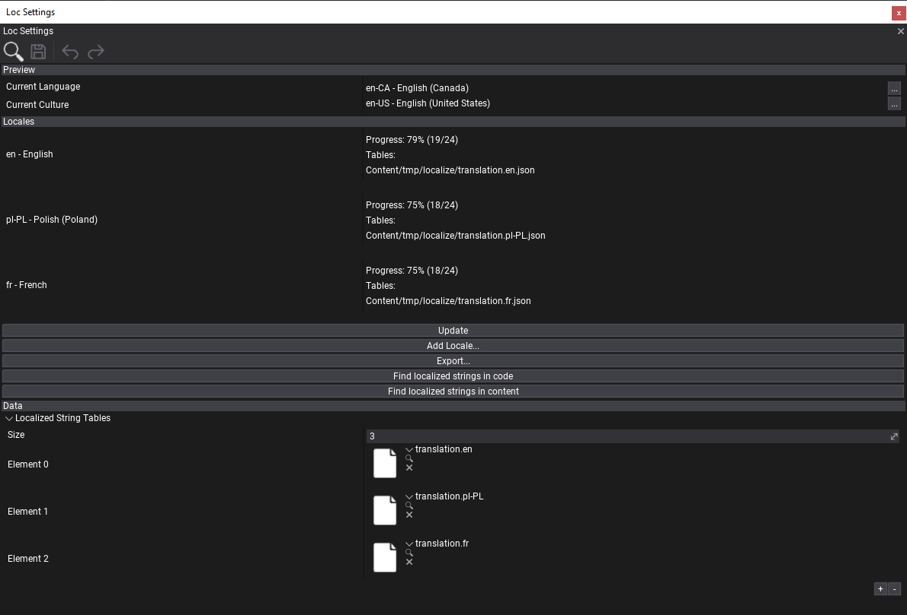
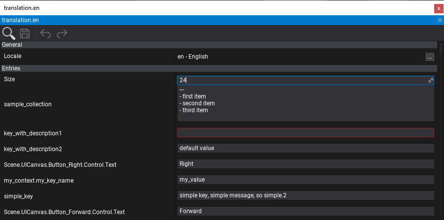
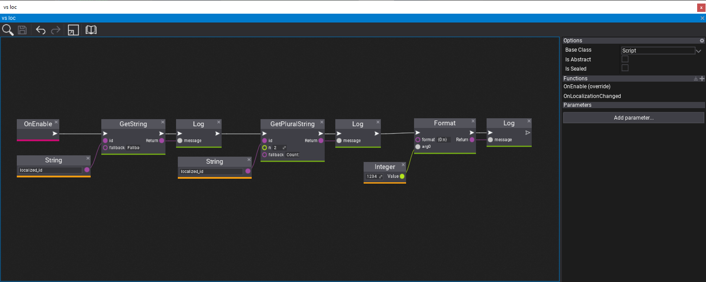
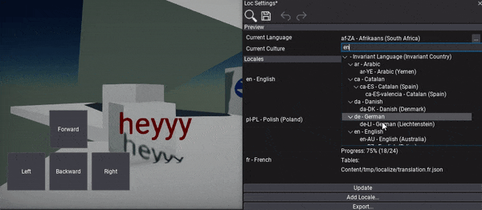
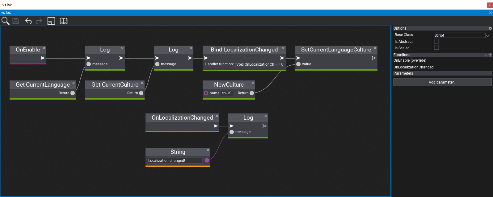

# Localization

Flax contains a wide range of tools for games localization and internalization. This includes UI language localization, values culture (numbers, currency and date formatting) and creating translation for different languages. Follow this documentation section to learn how to translate your games for different languages.

Flax supports all cultures and implements `CultureInfo` type for both C++ and C# (RFC 4646).

## Localization Settings



**Localization Settings** is a json settings asset that contains localization configuration and is added to [Game Settings](../game-settings/index.md). It's a root dashboard for a game translation.

To create it use *Content* window, *right-click* and select **New -> Settings**. Then specify name, select type **Localization Settings** and confirm ([tutorial](../game-settings/index.md#creating-settings)).

### Editor sections

* **Preview** - current language and culture for in-game preview.
* **Locales** - list of supported localizations by a game. Each locale is defined by one or more Localized String Table assets. Dashboard displays the translation progress per-language and lists all used tables (double-click on table name to navigate to it in *Content* window).
* **Data** - raw-asset editor (list of used string tables for direct editing).

### Dashboard

**Locales** section offers language translation overview and contains a set of buttons for additional actions:
* **Update** - refreshes the dashboard statistics.
* **Add Locale...** - shows a culture picker and creates new localization for it with not translated string tables.
* **Export...** - exports the localization strings into `.pot` file for translation. Exported file contains all used keys for localization. Can be used to create `.po` files with translation for importing back to the project.
* **Find localized strings in code** - searches for localized string usage in inside a project source files.
* **Find localized strings in content** - searches for localized string usage in inside a project content files (scenes, prefabs).

### Workflow

Example workflow for using localization during game production.

1) *Levels and UI setup* - game developers create game maps and setup UI (on scenes or in prefabs). Various game objects and assets contains UI display strings. Programmers use `LocalizedString` type for texts (in scripts/assets) that will be localized in future.
2) *Localization setup* - add new localization settings to the project. Setup Locales that will be used in game (include default `en` language).
3) *Mark localizable texts* - use Localized String editor `+` button to generate localized string entry for all used UI texts.
4) *Find localized string* - use dashboard to find all localized strings in code and assets. It won't add duplicates but just new entries.
5) *Export* - export all localized string keys to `.pot` file for translation.
6) *Translate* - perform translation of all used texts (in external tool or by editing string table assets).
7) *Import translations* - import back translated `.po` files as `Localized String Table` (Localization Settings contains list of used tables)
8) *Test* - verify that translations are working fine. Use language preview utility to change language.

Depending on game production size and team experience the localization can be performed very early during production or later in production. Whatever works best for you.

## Localized String Table



`LocalizedStringTable` is an asset in json format that stores a list of localization texts for a given locale. It supports plural and multiline entries. Empty fields are highlighted with red outline to mark them as missing (need translation).

Flax supports **importing translated strings** from `.po` files into Localized String Table asset. Simply *drag&drop* it into *Content* window. To learn more about PO format see [this documentation](https://www.gnu.org/software/gettext/manual/html_node/PO-Files.html).

## Localized String


**Localized String** is scripting type for easy texts localziation. It contains two fields: `Id` and `Value`. *Id* is the localized string identifier, *Value* is custom overriden text value (if *Value* is set, the *Id* won't be used).

In Editor *Id* textfield contains utility button that shows a localized string picker from the Localization Settings. If *Value* field is empty then it will display watermark of the current text from the localization. You can also manually set *Value*. By using `+` button on the right side of the *Value* textfield you can add the text to the localization settigns for all locales in project (the inserted value will be passed to default `en` locale, rest of the cultures will have empty, missing text translation).

`LocalizedString` is supported in both C++ and C# scripting API and can be used for texts localization instead of raw `String` type. It supports implicit convertion between in-built string type and can be serialized or deserialized.

## Localization and Culture

`Localization` contains scripting API for string localization gather and implements values formatting handling for current culture.

### C#

```cs
var myStr = Localization.GetString("localized_id", "Fallback value");
var myStrPlural = Localization.GetPluralString("localized_id_n", 2, "Count: {}");
var number =  string.Format("{0:n}", 1234);
```

### C\+\+

```cpp
#include "Engine/Localization/Localization.h"

auto myStr = Localization::GetString(TEXT("localized_id"), TEXT("Fallback value"));
auto myStrPlural = Localization::GetPluralString(TEXT("localized_id_n"), 2, TEXT("Count: {}"));
auto number =  String::Format(TEXT("{0:n}"), 1234);
```

To learn more about string formatting in C++ see [this documentation](../../scripting/cpp/string-formatting.md).

### Visual Script



## Changing current language

`Localization` contains scripting API for changing current display language for game and current culture for values formatting.

### Editor Preview

Use Localization Settings asset editor dashboard for current language preview.



### C#

```cs
using System.Globalization;

Debug.Log("Current language: " + Localization.CurrentLanguage);
Debug.Log("Current culture: " + Localization.CurrentCulture);
Localization.LocalizationChanged += () => { Debug.Log("Localization changed!"); };
Localization.SetCurrentLanguageCulture(new CultureInfo("en-US"));
```

### C\+\+

```cpp
#include "Engine/Localization/Localization.h"

void OnLocalizationChanged()
{
    LOG(Info, "Localization changed!");
}

LOG(Info, "Current language: {}", Localization::GetCurrentLanguage());
LOG(Info, "Current culture: {}", Localization::GetCurrentCulture());
Localization::LocalizationChanged.Bind(&::OnLocalizationChanged);
Localization::SetCurrentLanguageCulture(CultureInfo("en-US"));
```

### Visual Script


