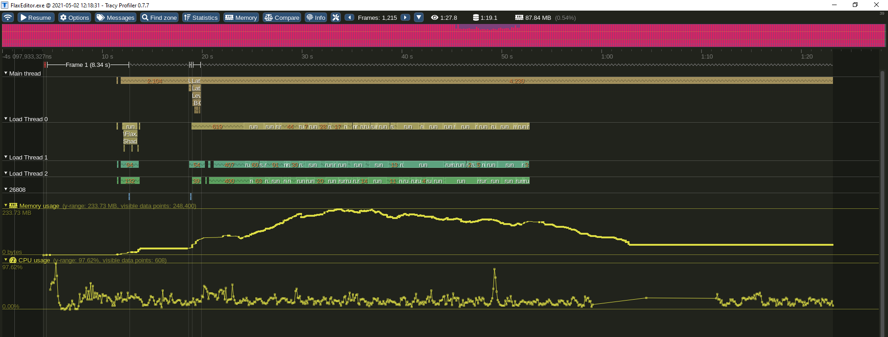
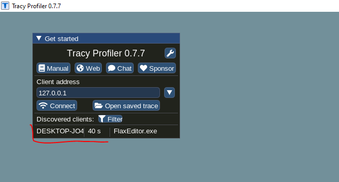
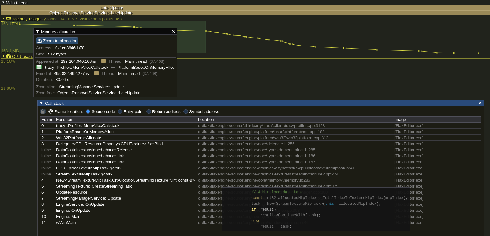

# Tracy Profiler

**Tracy** is C++ frame profiler and can be downloaded [here](https://github.com/wolfpld/tracy/releases).

Tracy supports profiling CPU, threading, memory, locks, context switches, and more. It's integrated into Flax and can be used to profile both game and engine in Editor or in cooked build (Debug or Development configurations).

## Setup



Download latest Tracy from [Github releases](https://github.com/wolfpld/tracy/releases), extract `Tracy-<version>.7z` file and run **Tracy.exe**. It will show active Flax. *Double-click* to connect and start collecting profiling data.



> [!Tip]
> Use *Tracy.pdf* manual to learn more about profiling and performance measurements.

## Profiler integration

Use Flax API to inject profile blocks:

### C++

```cpp
#include "Engine/Profiler/ProfilerCPU.h"

PROFILE_CPU();
// do some stuff
```

### C#

```cs
Profiler.BeginEvent("MyFunc");
// do some stuff
Profiler.EndEvent();
```

## Automated data collection


Tracy supports automatic instrumentation of the profiled code without injecting the profiler sections/macros. To do so run Flax with admin rights (privilege elevation). In this mode, Tracy will also capture the CPU cores usage by other processes and will allow for more complex application profiling.

## Memory Profiling



Flax automatically captures the callstack for memory allocations and frees. This can be used in Tracy profiler app to analyze memory usage.
