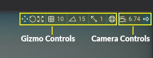
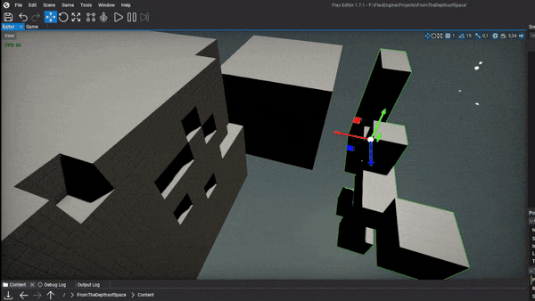
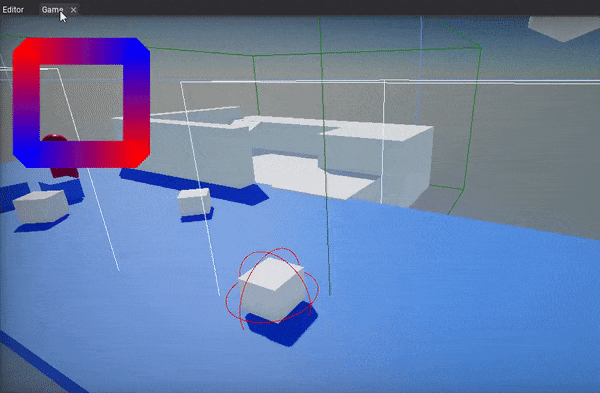
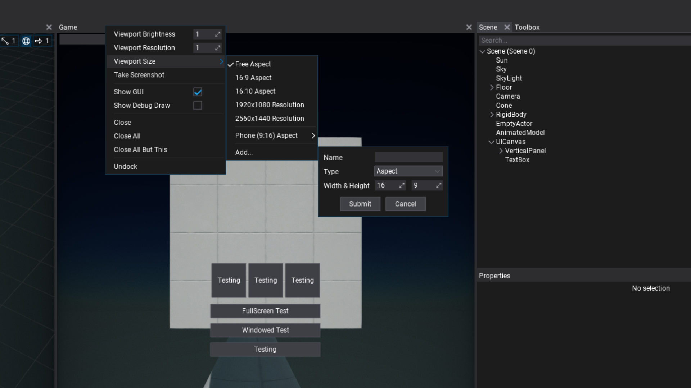

# Viewport

**Viewport** term refers to **Editor Window** and **Game Window**.
Both are used to preview the level.
* **Game** window - shows the current game camera view with GUI and game input control logic
* **Editor** window - an interactive view into your level

## Editor window

This view allows navigating the camera through the scene as well as selecting, transforming and editing scene objects.

#### Widgets

The Editor viewport contains a set of widget buttons. In the upper left corner it has a *View* button that allows you to change the current viewport properties, debug rendering or spawn a new camera actor.

In the upper right corner there is set of widget buttons to control the transform gizmo and viewport camera speed.
To learn more about using a transform gizmo see [this page](../../get-started/scenes/transforming-actors.md).

### Controls

| Action | Description |
|--------|--------|
| **LMB** | Select object |
| **Ctrl + LMB** | Add/remove object from selection |
| **RMB** | Rotate camera |
| **RMB + Arrows/WSAD** | Move camera |
| **RMB + MMB** | Move camera |
| **MMB** | Pan camera |
| **Mouse Wheel** | Zoom in/out |
| **RMB + Shift** | Speed up camera by 2 |
| **RMB + Mouse Wheel** | Change camera speed up/down |
| **Alt + LMB** | Orbit camera (around last viewed object center, translated) |
| **F** | Show selected actor (focus on it) |
| **R** | Rotate selected actors (by 45 degrees) |
| **Delete** | Delete selected objects |
| **End** | Snap selected objects to the ground |
| **1** | Set gizmo mode to *Translate* |
| **2** | Set gizmo mode to *Rotate* |
| **3** | Set gizmo mode to *Scale* |

All key shortcuts related to level editing windows (viewport, scene window, properties, etc.) are available. For instance, use **Ctrl + S** to save all changes.
Note: some input configurations can be changed via the Editor Options.

### Vertex Snapping

**Vertex Snapping** allows quickly building scenes by taking advantage of automatic precise transformation origin placement based on the mesh's vertices locations. This allows using the vertex as a transformation origin (eg. to rotate an object around it) or to snap an object to the vertex of another mesh.

This includes two actions:
* Holding `V` key to pick the vertex nearby the mouse cursor to use as an origin.
* Using translation gizmo while holding `V` key to snap the gizmo origin to the nearby objects vertices.

## Game window

The Game Window is rendered from the camera(s) in your game.
It is representative of your final, built game during in-editor simulation.
You will need to use one or more cameras to control what the player actually sees when they are playing your game.

#### Screenshots

You can use *right-click* on Game window tab to take game viewport screenshot (saved inside *Screenshots* folder in project). To make higher resolution screenshots (eg. for marketing of your game or project) use **Viewport Resolution** and scale up the window backbuffer (eg. by 2-4).

#### Utilities

You can use *right-click* on Game window tab to show or hide game UI or DebugDraw shapes.

#### Game viewport sizing

*Right-click* on Game window tab to use **Viewport Size** submenu to override viewport aspect ratio or resolution. For example, it can be used to test cut-scene animation in 16:9 aspect ratio or to test mobile game viewport on iPhone or Android devices. You can use predefined viewport sizes or add custom ones.

