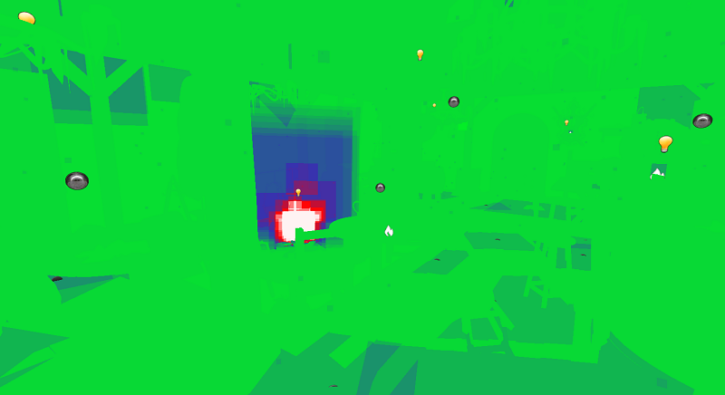

# Debug View

For more advanced graphics debugging and scene rendering preview you can use **Debug View**. This feature allows to output one of the intermediate buffers or show the special rendering features debug view.

It's avaliable to use in every Editor viewport by using **View -> Debug View**.


The full list of options and the documentation is available [here](https://docs.flaxengine.com/api/FlaxEngine.ViewMode.html).

You can also adjust those options from code:

```cs
MainRenderTask.Instance.View.Mode = ViewMode.Diffuse;
```

## LOD Preview


**LOD Preview** displays scene meshes in colors based on the LOD index. This comes handy when debugging model LODs transitions based on distance or object screen-size. The table below shows the legend of the colors used for this debug view.

| LOD 0 | LOD 1 | LOD 2 | LOD 3 | LOD 4 | LOD 5 |
|--------|--------|--------|--------|--------|--------|
|  White <div style="background-color: white; width: 10px; padding: 10px; border: 1px solid black;"> | Red <div style="background-color: red; width: 10px; padding: 10px; border: 1px solid black;"> | Orange <div style="background-color: orange; width: 10px; padding: 10px; border: 1px solid black;"> | Yellow <div style="background-color: yellow; width: 10px; padding: 10px; border: 1px solid black;"> | Green <div style="background-color: green; width: 10px; padding: 10px; border: 1px solid black;"> | Blue <div style="background-color: blue; width: 10px; padding: 10px; border: 1px solid black;"> |

## Material Complexity



**Material Complexity** displays per-pixel complexity of the materials rendering. It colors the pixels based on the number of shader instructions, blending mode used, textures usage, and tessallation usage. This works in general as a good indication of performance metric of the materials and can be used to analyze and optimize scenes. The table below shows the legend of the colors used for this debug view.

| Ideal | Good | Complex | Expensive |
|--------|--------|--------|--------|
|  Green <div style="background-color: #00f71e; width: 10px; padding: 10px; border: 1px solid black;"> | Blue <div style="background-color: #3333b2; width: 10px; padding: 10px; border: 1px solid black;"> | Red <div style="background-color: #ff0000; width: 10px; padding: 10px; border: 1px solid black;"> | White <div style="background-color: #fff2f2; width: 10px; padding: 10px; border: 1px solid black;"> |

## Quad Overdraw


**Quad Overdraw** displays per-pixel overdraw that accumulates during scene rendering. It is useful when analyzing geometry complexity (eg. too high poly meshes), models culling, and analyze overdraw from other objects such as particles and decals. The table below shows the legend of the colors used for this debug view based on the amount of triangles covering given pixel.

| 1 | 2 | 3 | 4 | 5 | 6 | 7 | 8 |
|--------|--------|--------|--------|--------|--------|--------|--------|
| <div style="background-color: #029319; width: 10px; padding: 10px; border: 1px solid black;"> | <div style="background-color: #00ff95; width: 10px; padding: 10px; border: 1px solid black;"> | <div style="background-color: #00fffd; width: 10px; padding: 10px; border: 1px solid black;"> | <div style="background-color: #8efa00; width: 10px; padding: 10px; border: 1px solid black;"> | <div style="background-color: #fffb00; width: 10px; padding: 10px; border: 1px solid black;"> | <div style="background-color: #ff9300; width: 10px; padding: 10px; border: 1px solid black;"> | <div style="background-color: #941100; width: 10px; padding: 10px; border: 1px solid black;"> | <div style="background-color: #ffffff; width: 10px; padding: 10px; border: 1px solid black;"> |

Reference: [https://blog.selfshadow.com/2012/11/12/counting-quads/](https://blog.selfshadow.com/2012/11/12/counting-quads/)
