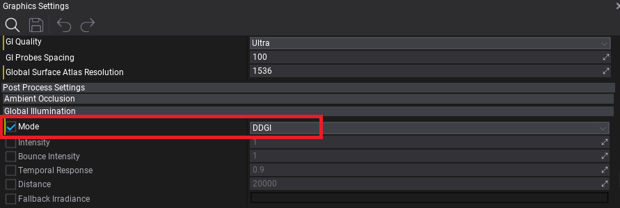
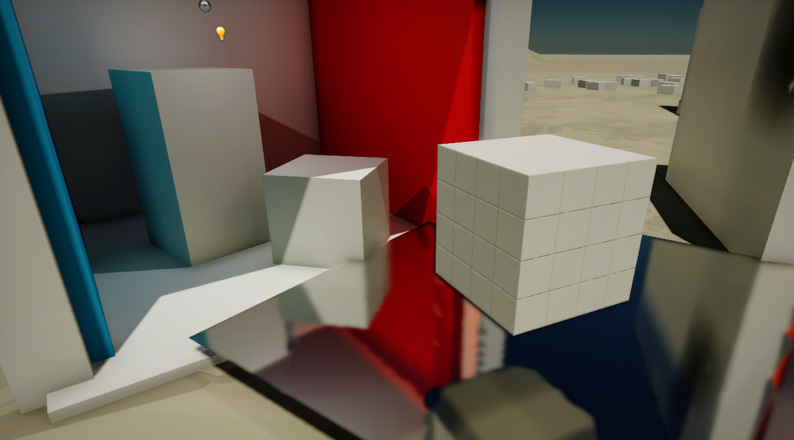
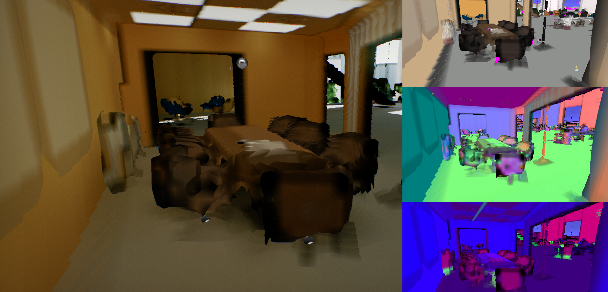

# Realtime Global Illumination

When creating large worlds or dynamic environment where lighting conditions are constantly changing (eg. time of the day) you can use **Realtime Global Illumination** to render indirect light passing though the scene. This documentation page explains how to use GI in your projects.

## Dynamic Diffuse Global Illumination

[Dynamic Diffuse Global Illumination](https://morgan3d.github.io/articles/2019-04-01-ddgi/) (**DDGI**) is an algorithm implemented in Flax to render dynamic global illumination with indirect lighting. It uses light probes (world-space, automatically placed) to gather indirect lighting at a fixed location and sample it later in materials (opaque, transparent and volumetric). To prevent light leaking, which is cammon problem of light probe-based solutions, DDGI algorithm renders low-resolution depth buffer around each probe and applies *Chebyshev* visibility weight. DDGI probes are placed around the camera and are split into series of cascades to cover whole scene. When camera moves though the scene, the probes are scrolled to maintain GI coverage.

### DDGI Algorithm

Flax implementation of DDGI algorithm uses custom **Software Ray Tracing** and automatically **scrolled probes volume** with up to **4 cascades**. Watch video below to learn more about technical and artistic aspects of this rendering feature:

Implementation is based on following papers:
* "Dynamic Diffuse Global Illumination with Ray-Traced Irradiance Probes", Journal of Computer Graphics Tools, April 2019, Zander Majercik, Jean-Philippe Guertin, Derek Nowrouzezahrai, and Morgan McGuire
* "Scaling Probe-Based Real-Time Dynamic Global Illumination for Production", [https://jcgt.org/published/0010/02/01/](https://jcgt.org/published/0010/02/01/)
* "Dynamic Diffuse Global Illumination with Ray-Traced Irradiance Fields", [https://jcgt.org/published/0008/02/01/](https://jcgt.org/published/0008/02/01/)

### Using DDGI

Use Post Process Settings in [Graphics Settings](../../../editor/game-settings/graphics-settings.md) or [PostFX Volume](../../post-effects/post-fx-volumes.md) settings to and set **Mode** to **DDGI** (under *Global Illumination* category). Then you can adjust options:

| Option | Description |
|--------|--------|
| **Intensity** | Global Illumination indirect lighting intensity scale. Can be used to boost or reduce GI effect. |
| **BounceIntensity** | Global Illumination infinite indirect lighting bounce intensity scale. Can be used to boost or reduce GI effect for the light bouncing on the surfaces. |
| **Temporal Response** | Defines how quickly GI blends between the the current frame and the history buffer. Lower values update GI faster, but with more jittering and noise. If the camera in your game doesn't move much, we recommend values closer to 1. |
| **Distance** | Draw distance of the Global Illumination effect. Scene outside the range will use fallback irradiance. |
| **Fallback Irradiance** | The irradiance lighting outside the GI range used as a fallback to prevent pure-black scene outside the Global Illumination range. |

Additional relevant options in [Graphics Settings](../../../editor/game-settings/graphics-settings.md):

| Option | Description |
|--------|--------|
| **GI Quality** | The Global Illumination quality. Controls the quality of the GI effect. |
| **GI Probes Spacing** | The Global Illumination probes spacing distance (in world units). Defines the quality of the GI resolution. Adjust to 200-500 to improve performance and lower frequency GI data. |
| **Global Surface Atlas Resolution** | The Global Surface Atlas resolution. Adjust it if atlas `flickers` due to overflow (eg. to 4096). |

### Ray Traced Reflections

Additionally to diffuse lighting the specular lighting can be improved with Global Illumination by changing **Trace Mode** to **Software Tracing** in Screen Space Reflections settings (in Graphics Settings or in PostFx Volume). This uses our custom Software Tracing of Global Surface Atlas as a fallback to the default *Screen Tracing* which is screen-space depth buffer tracing with scene color sampling. Only visible on-screen pixels can be used in reflections. With software raytracing using Global SDF and Global Surface Atlas  full-scene raytracing is used  that provides reflections of the objects off-screen. Using this can significant performance impact (between 0.5-1ms of GPU time) but drastically enhances the look of the scenes by making the lighting more realistic and complete.

### Software Ray Tracing

Key difference bwetween original DDGI algorithm implementation and Flax implementation is use of cusform **software raytracing instead of hardware raytracing**. That's becase we wanted to support using realtime GI on an older hardware that doesn't support RTX-features. Our implementation uses *Signed Distance Fields* rasterized into [Global SDF](../../models/sdf.md) to perform ray tracing though the scene. However, this returns only point of intersection between ray and scene geometry while the GI needs also to evaluate the direct lighting (and bounced indirect lighting as well). To solve this we implemented **Global Surface Atlas** which is a render pass that renders surfaces of the scene objects nearby camera into a one giant atlas texture which projections of the object sides. This works simialr to GBuffer rendering where materials output low-resolution color, emissive, roughness, normal, depth, etc. Then we light those pixels to evaluate direct and indirect lighting on the material surfaces. Global Surface Atlas allwos to sample these surfaces at arbitay location in the world which makes it possible to evaluate lighting at the Global SDF trace hit location.

Above you can see the Debug view of Global Surface Atlas (opened via **View -> Debug View Global Surface Atlas**). Main part of the view contains the debug view of the scene viewport rasterized using Global SDF tracing from camera and then sampling atlas lighting. **That's what Software Raytracer sees** and what is used for evaluating Global Illumination thus **it's essential to use this viewport to inspect the scene** when working on GI in your levels. On the right, starting from the top you can see the Diffuse color of the Atlas surfaces, Normal vectors and packed other properties (AO, roughness, metalness).

As you can see, the Global Surface Atlas is low-resolution representation of the scene, and combined with Global SDF has **precision between 10-20cm nearby camera**. It can efficently cover scene up to 500m to have global lighting far from camera. You can adjust the maximum atlas resolution in Graphics Settings by controlling *Global Surface Atlas Resolution* property. Scenes with large amount of content should use bigger atlas size to contain all objects inside it.

### Debugging Surface Atlas

Common problem when working with DDGI in Flax is not efficent representation of the object surfaces in Global Surface Atlas. In manu cases that's caused by inaccurate SDF mesh representation but also missing surface coverage in atlas. Debug viewport for Surface Atlas highlights <b>missing surface pixels with 
pink color
</b> inside the Diffuse viewport (upper right corner). This is usually caused by using large meshes with interiors because the object projections are perform from 6 object sides (top, bottom, left, right, front and back). In most cases, minimal pink color can appear but should be minimized in order to have good indirect lighting quality. There are several ways to improve this in your scenes:
* try splitting large objects into smaller parts (eg. house building walls split into 4 parts with separate roof and floor),
* setup LODs for meshes (Surface Atlas uses always the lowest LOD for rasterization).

### Debugging DDGI Probes

Use **View -> Debug View -> Global Illumination** to preview DDGI probes in a viewport. This can be usefull to analyze problems with GI in your scene. Probes are using automatic relocation in the local neighberhood to prevent intersecting with the scene geometry thus it might be essential to debug this view.

### DDGI Tips & Tricks

* Setup proper [Global SDF](../../models/sdf.md) for a scene.
* Use `StaticFlags` on static scene object to optimize rendering.
* If object surface changes color/emissive frequently (eg. animated or toggled at runtime) remove `StaticFlgas.Lightmap` for it to be updated frequently instead of cached.
* Use LOD for complex meshes (Global Surface Atlas rasterization is faster for lower tris meshes).
* Material **Position Offset is not supported** and might cause lighting issues.
* **Meshes need to have simple interiors** (eg. house model with separate walls) - use Global Surface Atlas debug view to analyze your content.
* Large emissive surface like TV screen might need additional light source to correctly cover specular lighting.
* Small emissive objects might flicker due to imperfections caused by reduced rendering resources resolution.

### DDGI Cost

* DDGI uses up to 69 MB of GPU memory (depending on quality)
* Global Surface Atlas uses around 49 MB of GPU memory (or more when using higher resolution)
* Global SDF uses up to 130 MB of GPU memory (depending on quality)
* Models SDFs can use several MBs of GPU memory
* Total GPU memory usage of DDGI is between 200-400 MB (dependong on quality and content)
