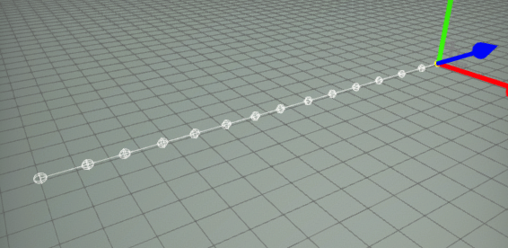
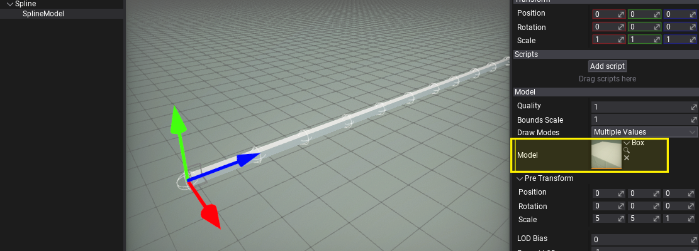
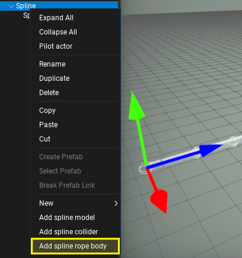
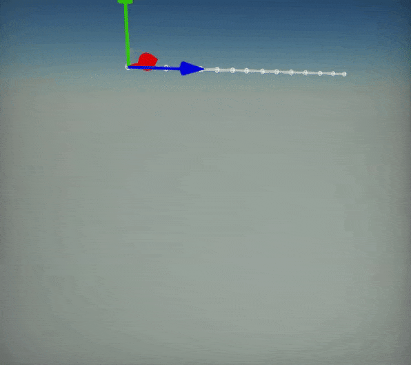

# HOWTO: Create dynamic chain from spline

In the following tutorial, you will learn how to create a dynamic chain/rope/cable with physics using spline components.

## Tutorial

### 1. Create a spline

Follow [this](index.md) tutorial and create a simple spline with a series of approximatly 6-15 points placed evenly over a line.

### 2. Add a model to the spline

*Right-click* on the spline actor in the *Scene* window and select the option **Add spline model**. This will create a spline model rendering actor as a child of the spline. It will draw a model between the spline's segments. In this example it will be used to draw chain segments.

Now set the model you want to draw over the spline. You can use one of the built-in primitives, such as a box or cylinder if you don't have your own chain/rope/cable model. Also, remember to use the **Pre Transform** property to adjust the model rotation, scale and translation so the spline will look as desired.

If you want to use a custom material for the spline model ensure the **material domain** is set to **Deformable**. In this way a special shader is used to deform the mesh over the spline curve. Also, it supports tessellation to improve model geometry for highly bent meshes.

### 3. Add the rope body to the spline

*Right-click* again on the spline actor in the *Scene* window and select the option **Add spline rope body**. When this actor is added as a child to a Spline runs a physical simulation over that spline's points. The result is a highly efficient rope simulation which can be used on chains and cables in the scene to add more dynamic movement to them.

Feel free to adjust the rope body properties such as gravity, scale or other simulation settings. You can also attach the spline endpoint to other actors which will make both tips constrained.

### 4. Test it out!

Now, hit the *play* button and see the spline behaving like a chain, even if you move it around the scene.

Here is an example of chain between two objects:

