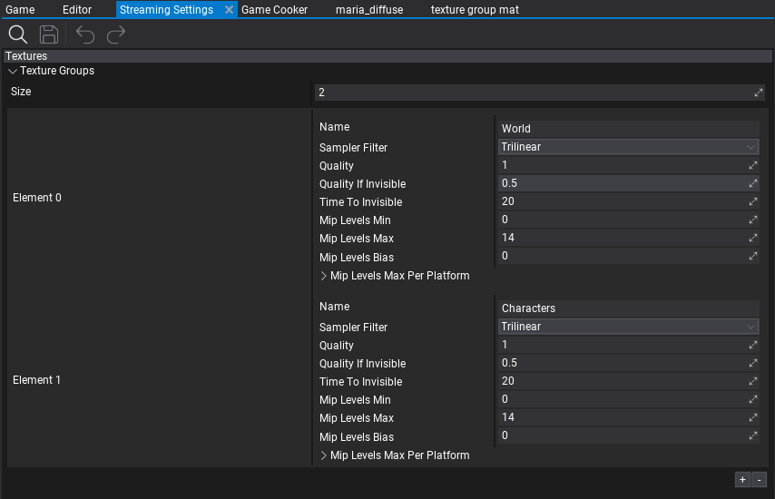
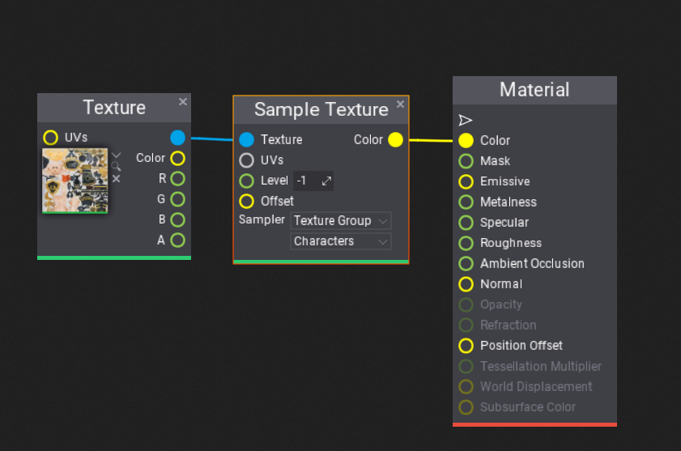

# Texture Groups

**Texture Groups** are engine feature that allows to group a set of texture resources together and use shared configuration for them. For example, textures used for terrain (diffuse maps, normal maps, etc.) can be grouped togather to use custom configuration for streaming, sampling and quality reduction. This help to organize the game content in larger projects.

Texture Groups can be used to control textures quality streaming speed and quality reduction for invisible textures. You can also define the textures resoltuion stripping per-platform to reduce game build size and increase performance for mobile or low-end platforms. Finally, texture groups can be used to control dynamic textures quality for PC games to match game performance to GPU performance and memory avaliable (textures quality and sampling options).

Follow this documentation section to learn how to use Texture Groups.

## Texture Group Setup

The first step is to create new *Streaming Settings* asset (or use existing one). To learn how to do it see this [tutorial](../../editor/game-settings/index.md).
Ensure the Streaming settings asset is set in *Game Settings*.

Then, add first texture group to the list. Each texture group contains several properties that can be modified at runtime (eg. from game scripts). Ensure to **preserve order of groups** as assets reference groups btexture-window.mdy index (rather than by *Name*).

To assign texture to a particual Texture Group use [Texture Window](texture-window.md) editor (*Properties* group) or assign it when [importing new textures](import-settings.md). Use a texture group picker for this that shows the lsit of texture groups in a project. For very specific scenarios you can also change the texture group from script at runtime.

## Properties

| Property | Description |
|--------|--------|
| **Name** | The name of the group (for developers to identify the group). |
| **Sampler Filter** | The default filtering method for samplers using this texture group. Possible options: <table><tbody><tr><th>Option</th><th>Description</th></tr><tr><td>**Point**</td><td>Filter using the nearest found pixel. Texture appears pixelated.</td></tr><tr><td>**Bilinear**</td><td>Filter using the linear average of the nearby pixels. Texture appears blurry.</td></tr><tr><td>**Trilinear**</td><td>Filter using the linear average of the nearby pixels and nearby mipmaps. Texture appears blurry.</td></tr><tr><td>**Anisotropic**</td><td>Filter using the anisotropic filtering that improves quality when viewing textures at a steep angles. Texture appears sharp at extreme viewing angles.</td></tr></tbody></table> |
| **Max Anisotropy** | The maximum number of samples that can be used to improve the quality of sample footprints that are anisotropic. Higher values improve texturing but reduce performance. Limited by GPU capabilities and used only if SamplerFilter is Anisotropic. |
| **Quality** | The quality scale factor applied to textures in this group. Can be used to increase or decrease textures resolution. In range 0-1 where 0 means lowest quality, 1 means full quality. |
| **Quality If Invisible** | The quality scale factor applied when texture is invisible for some time (defined by TimeToInvisible). Used to decrease texture quality when it's not rendered. |
| **Time To Invisible** | The time (in seconds) after which texture is considered to be invisible (if it's not rendered by a certain amount of time). |
| **Mip Levels Min** | The minimum amount of loaded mip levels for textures in this group. Defines the amount of the mips that should be always loaded. Higher values decrease streaming usage and keep more mips loaded. |
| **Mip Levels Max** | The maximum amount of loaded mip levels for textures in this group. Defines the maximum amount of the mips that can be loaded. Overriden per-platform. Lower values reduce textures quality and improve performance. |
| **Mip Levels Bias** | The loaded mip levels bias for textures in this group. Can be used to increase or decrease quality of the streaming for textures in this group (eg. bump up the quality during cinematic sequence). |
| **Mip Levels Max Per Platform** | The per-platform maximum amount of mip levels for textures in this group. Can be used to strip textures quality when cooking game for a target platform (editor-only). |

## Textures Streaming Quality

Flax by default streams all loaded textures to the highest available quality. However, larger scenes require move advanced configuration and streaming budget. By using Texture Groups settings and assigning certain textures to a specific group you can control global textures quality and define quality when texture is not rendered (invisible).

You can preview Texture Group settings live in Editor via **Graphics Quality window**. The example gif below shows the dynamic textures quality change.

## Textures Sampling

By default materials use **Trilinear Wrap** sampler when texturing objects. For custom sampler use **Sample Texture** node in material that contains option to select other sampler or use **sampler from texture gropup** (select Texture Group as sampler and pick a texture group to use). Then *Sampler Filter* and *Anisotropy* properties will be used to pass the sampler to the GPU shader. Those properties can be changed at runtime too (eg. to increase texture quality during cutscenes or manually from game main menu).

## Textures Quality Per-Platform

When creating cross-platform game you might want to reduce textures quality for a certain platform such as: Android or Switch. To do that use *Mip Levels Max Per Platform* property that allows to define maximum amount of mip levels for a target platform (per texture group). For instance, adding entry for *Android* with value of *10* will limit textures quality of a given group to 10 mips which limits textures resoltuion to 1024 pixels (width or height). This will be applied when cooking game so the final build will be smaller and run faster.
