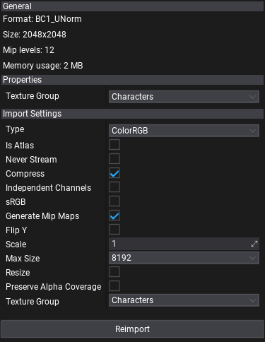

# Texture Window

The **Texture Window** is the main tool to preview and re-import texture assets. To access it simply double-click on a texture in a *Content* window.

## Interface

The texture window UI consists of a toolstrip, viewport and properties panel.

1. Toolstrip
2. Viewport
3. Properties Panel

### Toolstrip

The following table lists the options in the toolstrip and what they do.

| Icon | Description |
|--------|--------|
|  | Shows and selects the asset in the *Content* window |
|  | Re-imports the texture |
|  | Shows the whole material graph on the surface |

### Viewport

The viewport panel shows a preview of the texture. You can navigate in the viewport by using the **mouse buttons** or zoom in/out using the **mouse scroll wheel**.

In the upper left corner the viewport contains widget buttons. By pressing the `R/G/B/A` buttons you can toggle the visibility of individual texture channels. This is useful for debugging mask texture contents. You can also use buttons for changing the texture filtering in the preview between *Point* and *Linear*. Also, the **Mip** button can be used to preview any texture mip map contents.

### Properties panel

This panel shows texture information and settings.

- The **General** group contains information about the texture's data format, size and memory usage.
- The **Properties** group contains texture options that can be adjusted (ensure to save asset after editing).
- The **Import Settings** group contains texture import options (restored from last import). You can modify them and press the **Reimport** button to update the asset from the source image file

To learn more about texture import options see the dedicated [Texture Import Settings](import-settings.md) page.
