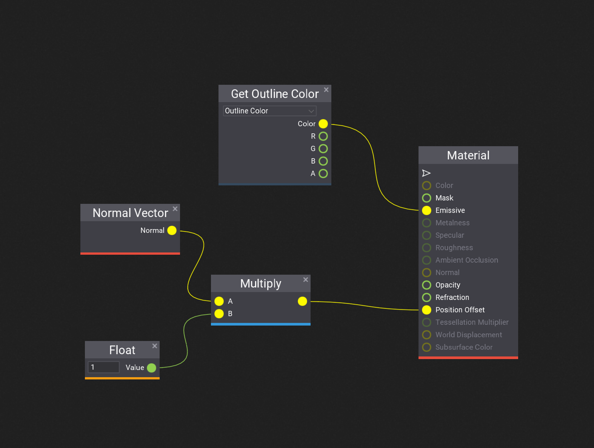

# Additional render pass

In this tutorial you will learn how to inject a custom render pass into the pipeline. This technique is widely adopted in a lot of custom effects. This tutorial will implement a Toon-style outline by the method of back face fattening, which requires an additional outline pass after the opaque object is rendered. 

## 1. Create the outline material

Firstly, create a new material as the toon outline material. You can do it manually or use Editor and *right-click* in Content window content folder **New -> Material -> Material**.

To implement back face fattening, You have to expand the model by a little through moving the vertex a bit in the direction of the normal. Only back faces of the enlarged model is rendered so that the original model won't be occluded. Open the material and set the Blend Mode to **Transparent** and set the Cull Mode to **Inverted**, turn off Z Test and Z Write. Then setup the graph as the image below: 



## 2. Write rendering code

Next step is to inject a custom render pass by the `PostProcessEffect` class and render it. 
Create C# script and add it to the any actor on the scene. You can use [this tutorial](../../scripting/new-script.md) to learn how to do it. Then, write the following code:

```cs
using System.Runtime.InteropServices;
using FlaxEngine;

namespace Game;

/// <summary>
/// OutlineRenderer Script.
/// </summary>
public class OutlineRenderer : PostProcessEffect
{

    private Material _material;
    private Model _model;

    public Material OutlineMaterial
    {
        get => _material;
        set
        {
            if (_material != value)
            {
                _material = value;
            }
        }
    }

    public override unsafe void OnEnable()
    {
        // This postfx overdraws the input buffer without using output
        UseSingleTarget = true; 
        // Custom draw location in a pipeline, before forward pass so that the draw call could be executed together with other forward draw calls
        Location = PostProcessEffectLocation.BeforeForwardPass; 

        // Get the actor as a `StaticModel` (or `AnimatedModel` instead)
        var modelInstance = Actor as StaticModel;
        // Get the actual `Model`
        _model = modelInstance.Model;

        // Register postFx to all game views (including editor)
        SceneRenderTask.AddGlobalCustomPostFx(this);
    }

    public override void OnDisable()
    {
        // Remember to unregister from events and release created resources (it's gamedev, not webdev)
        SceneRenderTask.RemoveGlobalCustomPostFx(this);
    }

    public override bool CanRender()
    {
        return base.CanRender() && _material;
    }

    public override unsafe void Render(GPUContext context, ref RenderContext renderContext, GPUTexture input, GPUTexture output)
    {
        // Second pass: draw the model with the outline material

        // Get the transform of the actor
        Actor.GetLocalToWorldMatrix(out var world);
        
        // Submit the draw call to the render list, which will be handled later in the forward pass
        _model.Draw(ref renderContext, _material, ref world, StaticFlags.None, false);
    }
}
```

It overrides **PostProcessEffect** class which is used to inject custom rendering code into the in-build graphics pipeline.
As you can see, the script registers in `OnEnable` and disposes in `OnDisable`. The actual rendering is performed in `Render` method that submits the draw call. 

Then **add script** to a model actor on scene and **assign the Outline Material** created in step 2 to **Outline Material** property. 

## 4. See results

Once you setup material, script and add it to a scene model you should be able to see the outline pass working (under game mode). In case of problems see *Output Log* window in Editor as it may contain any compilation errors.


