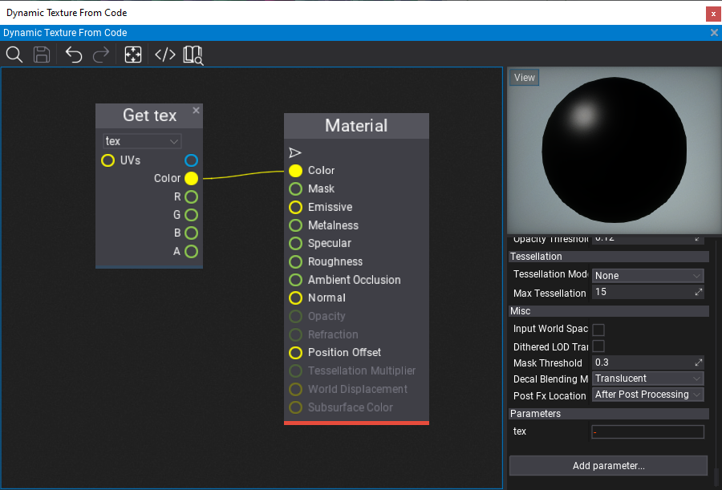

# HOWTO: Use dynamic texture


In this tutorial, you will learn how to create a GPU texture from C# script that will be updated every frame with a custom data send from CPU to GPU.

## Tutorial

### 1. Create new C# script `DynamicTextureFromCode`

### 2. Write texture data generating code

```cs
public class DynamicTextureFromCode : Script
{
    private GPUTexture _tempTexture;
    private MaterialInstance _tempMaterialInstance;
    private byte[] _data;

    public Material Material;
    public Model Model;

    public override void OnStart()
    {
        // Ensure that model asset is loaded
        Model.WaitForLoaded();

        // Create new GPU texture
        var texture = new GPUTexture();
        _tempTexture = texture;
        var desc = GPUTextureDescription.New2D(64, 64, PixelFormat.R8G8B8A8_UNorm, GPUTextureFlags.ShaderResource);
        if (texture.Init(ref desc))
            return;

        // Use a dynamic material instance with a texture to sample
        var material = Material.CreateVirtualInstance();
        _tempMaterialInstance = material;
        material.SetParameterValue("tex", texture);

        // Add a model actor and use the dynamic material for rendering
        var staticModel = Actor.GetOrAddChild<StaticModel>();
        staticModel.Model = Model;
        staticModel.SetMaterial(0, material);

        // Plug into rendering to update texture at runtime
        MainRenderTask.Instance.PreRender += OnPreRender;
    }

    public override void OnDestroy()
    {
        MainRenderTask.Instance.PreRender -= OnPreRender;

        // Ensure to cleanup resources
        _tempTexture?.ReleaseGPU();
        FlaxEngine.Object.Destroy(ref _tempTexture);
        FlaxEngine.Object.Destroy(ref _tempMaterialInstance);
    }

    private unsafe void OnPreRender(GPUContext context, RenderContext renderContext)
    {
        if (!Enabled || !Actor.IsActiveInHierarchy)
            return;

        var desc = _tempTexture.Description;
        var size = desc.Width * desc.Height * PixelFormatExtensions.SizeInBytes(desc.Format);
        if (_data == null || _data.Length != size)
            _data = new byte[size];
        fixed (byte* dataPtr = _data)
        {
            // Generate pixels data (linear gradient)
            var colorsPtr = (Color32*)dataPtr;
            var offset = Mathf.Cos(Time.GameTime * 3.0f) * 0.5f + 0.5f;
            for (int y = 0; y < desc.Height; y++)
            {
                float t1 = (float)y / desc.Height;
                var c1 = Color32.Lerp(new Color32((byte)(offset * 255), 0, 0, 1), Color.Blue, t1);
                var c2 = Color32.Lerp(Color.Yellow, new Color32(0, (byte)(144 - offset * 80), 0, 1), t1);
                for (int x = 0; x < desc.Width; x++)
                {
                    float t2 = (float)x / desc.Width;
                    colorsPtr[y * desc.Width + x] = Color32.Lerp(c1, c2, t2);
                }
            }

            // Update texture data on a GPU (send data)
            uint rowPitch = (uint)size / (uint)desc.Height;
            uint slicePitch = (uint)size;
            context.UpdateTexture(_tempTexture, 0, 0, new IntPtr(dataPtr), rowPitch, slicePitch);
            _tempTexture.ResidentMipLevels = 1; // Mark mip-map as available (required for normal textures only)
        }
    }
}
```

### 3. Create material

Create a sample material that contains a public **GPUTexture** parameter named `tex`. It's used by the script to assign a texture to draw.



### 4. Link material and model

Add created script `DynamicTextureFromCode` to an actor in your scene (or create a new one for it). Then select it and assign the model and created material (as shown in a picture below).

### 5. Test it out!

Press **Play** (or *F5*) and see the results! It will be updated only if Game Viewport is active (opened) because this example uses `MainRenderTask.Instance` to handle custom GPUContext logic before frame rendering. To overcome this you can create and use your own `RenderTask` object to use the rendering pipeline independently of the game view.


