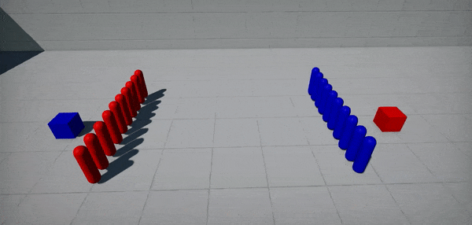

# Nav Crowd

**Nav Crowd** is a navigation steering behaviors system for a group of agents. It handles avoidance between agents by using an adaptive RVO sampling calculation. It can be used to implement automatic avoidance and movement for a crowd of agents using navmesh.

Below you can see an example of difference between [simple path following agents](tutorials/path-following.md) and agents using `NavCrowd`.

| Before | After |
|--------|--------|
|  |  |

## Setup

Create gameplay system to manage crowd (as `GamePlugin`).

```cs
/// <summary>
/// Navigation agents crowd system using <see cref="FlaxEngine.NavCrowd"/>.
/// </summary>
public class CrowdSystem : GamePlugin
{
    private NavCrowd _crowd;
    private CrowdTaskGraphSystem _system;

    /// <summary>
    /// The maximum amount of crowd agents (at once).
    /// </summary>
    public int MaxAgents = 25;

    internal void AddAgent(Agent007 agent)
    {
        if (_crowd == null)
        {
            // Lazy init
            _crowd = new NavCrowd();
            if (_crowd.Init(agent.Properties, MaxAgents))
                throw new Exception("Failed to initialize crowd");
            if (_system == null)
                Engine.UpdateGraph.AddSystem(_system = new CrowdTaskGraphSystem { System = this });
        }

        // Add agent to the crowd
        agent.AgentID = _crowd.AddAgent(agent.Actor.Position, agent.Properties);
        if (agent.AgentID == -1)
            throw new Exception("Failed to add agent to the crowd");
        agent.Crowd = _crowd;
    }

    internal void RemoveAgent(Agent007 agent)
    {
        // Remove agent from the crowd
        _crowd.RemoveAgent(agent.AgentID);
        agent.Crowd = null;
        agent.AgentID = -1;
    }

    /// <inheritdoc />
    public override void Deinitialize()
    {
        // Cleanup
        Engine.UpdateGraph.RemoveSystem(_system);
        FlaxEngine.Object.Destroy(ref _system);
        FlaxEngine.Object.Destroy(ref _crowd);

        base.Deinitialize();
    }
    
    /// <summary>
    /// Custom Task Graph System that updates crowd during async job.
    /// </summary>
    private sealed class CrowdTaskGraphSystem : TaskGraphSystem
    {
        internal CrowdSystem System;

        /// <inheritdoc />
        public override void Execute(TaskGraph graph)
        {
            // Schedule async job to update crowd
            graph.DispatchJob(UpdateJob);
        }

        private void UpdateJob(int i)
        {
            // Update crowd simulation
            System._crowd.Update(Time.DeltaTime);
        }
    }
}
```

Create path following agent script that will be attached to the actor (eg. `CharacterController`).

```cs
public class Agent007 : Script
{
    internal NavCrowd Crowd = null;
    internal int AgentID = -1;
    private Vector3 _targetPos;

    /// <summary>
    /// The target object to follow.
    /// </summary>
    public Actor MoveToTarget;

    /// <summary>
    /// The offset applied to the actor position on moving it.
    /// </summary>
    public Vector3 Offset = new Vector3(0, 100, 0);

    /// <summary>
    /// Agent properties.
    /// </summary>
    public NavAgentProperties Properties = new NavAgentProperties
    {
        Radius = 34.0f,
        Height = 144.0f,
        StepHeight = 35.0f,
        MaxSlopeAngle = 60.0f,
        MaxSpeed = 500.0f,
        CrowdSeparationWeight = 2.0f,
    };

    /// <inheritdoc />
    public override void OnEnable()
    {
        // Register
        PluginManager.GetPlugin<CrowdSystem>().AddAgent(this);
    }

    /// <inheritdoc />
    public override void OnDisable()
    {
        // Unregister
        PluginManager.GetPlugin<CrowdSystem>().RemoveAgent(this);
    }

    /// <inheritdoc />
    public override void OnUpdate()
    {
        if (!MoveToTarget || !Crowd)
            return;
        var currentPos = Actor.Position;
        var targetPos = MoveToTarget.Position;

        // Check if need to change target position
        if (targetPos != _targetPos)
        {
            _targetPos = targetPos;
            Crowd.SetAgentMoveTarget(ID, targetPos);
        }

        // Update agent position (calculated by NavCrowd)
        targetPos = Crowd.GetAgentPosition(ID) + Offset;
        Actor.AddMovement(targetPos - currentPos);
    }
}
```

As you can see, the agent logic is more straightforward than in [Path Following Example](tutorials/path-following.md). That's because you don't need to manually query navigation paths for each agent. Instead, you can set per-agent Target Location (`SetAgentMoveTarget`) or Target Velocity (`SetAgentMoveVelocity`) to reach and `NavCrowd` automatically calculates the agent movement. The whole crowd is updated at once (with simulation delta-time). In the example above the `TaskGraphSystem` performs crowd computation in async on a Job System (learn more [here](../scripting/advanced/multithreading.md)).
