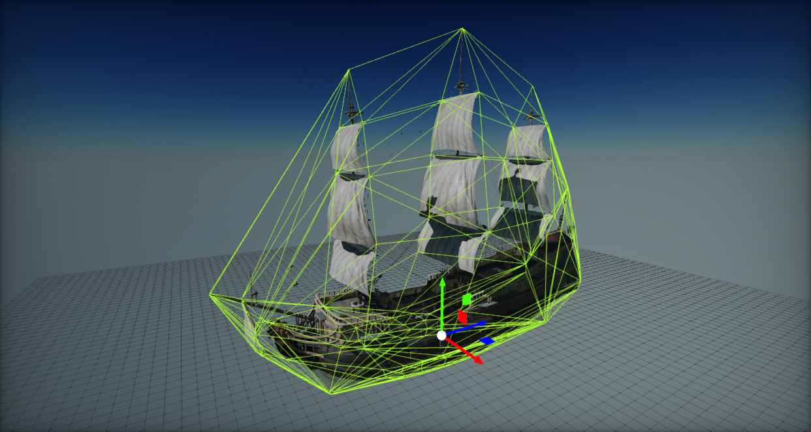

# Collision Data


**Collision Data** asset contains a baked mesh collision data used at runtime by [Mesh Colliders](mesh-collider.md).
It supports **convex meshes** and **triangle meshes** data.

## Create a collision data

To create a new collision data asset use the *Content* window. Right-click in the Content directory and select option **New -> Physics -> Collision Data**. Then specify the name and press *Enter* to confirm.


Now open the asset (double-click on it) and assign the model to use for a collider shape (set the **Model** property). Then press **Cook** button.


## Properties

| Property | Description |
|--------|--------|
| **Type** | Collision data type. |
| **Model** | Source model used to generate the collision mesh. Used are all the meshes from the selected LOD. |
| **Model LOD Index** | Source model LOD index. |
| **Convex Flags** | The convex mesh generation flags. See [ConvexMeshGenerationFlags](https://docs.flaxengine.com/api/FlaxEngine.ConvexMeshGenerationFlags.html) to learn more. |
| **Vertex Limit** | The convex mesh vertex limit. Use values in range [8;255]. |

### Collision data type
Flax allows you to generate a convex or a triangle mesh for your collision data.

#### Convex
A convex mesh is a simplified representation of a 3D object in which all internal angles are less than 180 degrees. This simplification results in a mesh with a uniform shape, and it's particularly well-suited for certain collision scenarios.



#### Triangle mesh
A triangle mesh is a more detailed representation of a 3D object, consisting of interconnected triangles. This mesh type is capable of accurately representing complex and concave shapes, making it valuable for accurate collisions.


As you can see, a triangle mesh offers much more granularity and better represents the mesh but it comes at a cost:
- More expensive both in terms of memory and calculations.
- **Cannot** be used with a Rigidbody. This means they can only be used to collide against them.

## Create collision data from code

Flax supports creating most of the asset types in Editor using C# scripts (with editor plugins). The same applies to the collision data asset. Here is an example code that bakes the asset:

```cs
// Cooks collision for existing model asset
var path = "Content/MyModel";
var model = Content.LoadAsync<Model>(path);
FlaxEditor.Editor.CookMeshCollision(path + "_Collision", CollisionDataType.ConvexMesh, model);
```

> [!TIP]
> When invoking the collision data cooking, please ensure to invoke it on a separate thread or via async job to not block the game thread.

If your game generates the geometry at runtime and you need to use collision for virtual models then you can enable physics settings option **Support Cooking At Runtime** (see [Physics Settings](../physics-settings.md)) and use the following code to create a virtual collision data asset:

```cs
var collisionData = Content.CreateVirtualAsset<CollisionData>();
collisionData.CookCollision(CollisionDataType.TriangleMesh, myModel);
```

