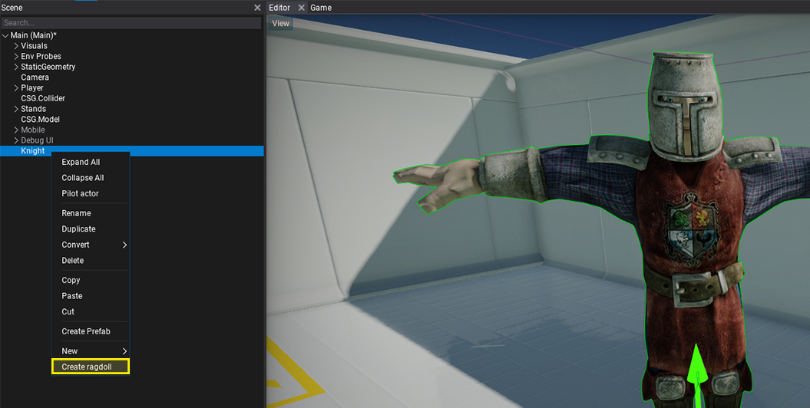
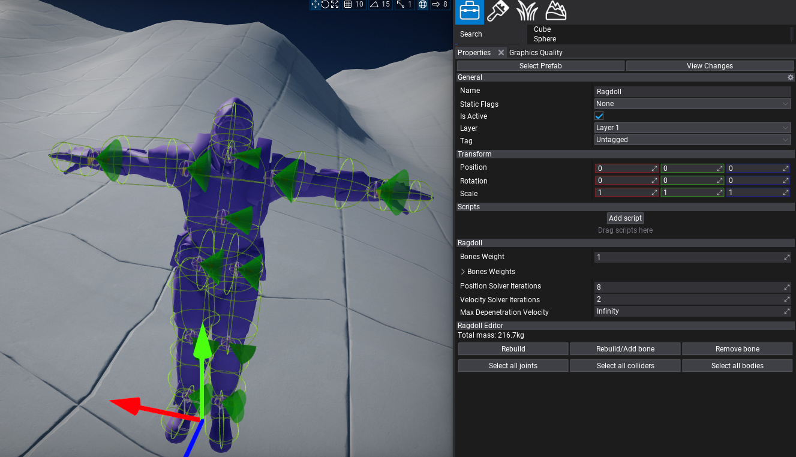

# Ragdolls

**Ragoll** is an actor that can override the animated model skeleton with physically simulated bones. Hierarchy of skeleton nodes with physical collision shapes linked with joints can be used to simulate realistic body behavior. This feature can be used to generate procedural death animation of the characters in-game or simulate parts of the skeleton that should behave more procedural (eg. tail).

## Create

The fastest way to create a ragdoll is to use an **in-built generator tool** that is available in Editor by using *right-click* in scene tree on **Animated Model** and selecting option **Create ragdoll**. It will generate a ragdoll as a child to it with the full hierarchy of physical bones.

Now, you can just press play and test it out. It will automatically override the skeleton pose with simulated bones (no matter if Anim Graph is used). You can set `BonesWeight` to 0 by default and switch it to `1` from code when needed to enable physical simulation for a character. Ragdoll can also blend between animated and simulated state or use just partial simulation for a specified set of bones. Also, if the certain bone is using only animation it will be animated accordingly so you can use ragdoll collision shapes for hit-testing via raycasts.

It's possible to use prefab for ragdoll to make it reusable or even add multiple ragdoll setups to the same model (just ensure to have enabled just one).

## Editor

When selected, ragdoll has a set of tools to use in editor properties panel:
* **Rebuild** - opens a popup with ragdoll rebuild settings. If your character is very small or large then adjust *Min Bone Size* to yield better results. You can also scale the created collision shapes with *Collision Margin* property.
* **Rebuild/Add bone** - opens a picker with a bone name to rebuild or add. It will ignore any min bone size limits and create it to reflect actually mesh part that uses that bone. Nodes that already exist are shown with white text color, nodes that are missing are greyed out to distinguish.
* **Remove bone** - opens a picker with a bone name to quickly remove. It will also fix any joints related to this bone to ensure that ragdoll will behave properly after bone removal.
* **Select all joints** - selects all joints used by the ragdoll bones.
* **Select all colliders** - selects all collider shapes used by the ragdoll bones.
* **Select all bodies** - selects all rigidbodies used by the ragdoll bones.

By using those tools you can generate or remove skeleton bones and quickly adjust multiple objects at once. Also if selected, Ragdoll displays all joints and colliders debug shapes. For more precise tweaking you can select particular colliders and joints. Each bone body uses by default a capsule but this can be modified or replaced with other shape (eg. box) or by even multiple shapes per bone. To learn more about adjusting **D6 Joint** see [this page](joints/d6-joint.md).

> [!NOTE]
> To quickly change joint type use *right-click* in scene tree and select option **Convert** to select a different type of joint. Editor will automatically maintain a joint target anchor frame.

Under the hood, ragdoll actor looks for *Rigidbody* children that have the name of the skeleton node and use them for simulation or updating with animated skeleton pose. Depending on the scene and ragdoll complexity the physics engine can dynamically simulate even several hundred ragdolls at once still maintaining stable performance. Please note, that by default if the camera moves far from the animated model it uses LOD for both model and pose update ticking rates which might be noticeable in some cases. This technique allows to save performance in large worlds - far models are updated once every 2, 3, 4 frames or less.

## Properties

| Property | Description |
|--------|--------|
| **Bones Weight** | The default bones weight where `0` means fully animated bone and `1` means fully simulate bones. Can be used to control all bones simulation mode but is overriden by per-bone *BonesWeights*. |
| **Bones Weights** | The per-bone weights for ragdoll simulation. Key is *bone name*, value is the *blend weight* where `0` means fully animated bone and `1` means fully simulated bone. Can be used to control per-bone simulation. |
| **Position Solver Iterations** | The minimum number of position iterations the physics solver should perform for bodies in this ragdoll. Higher values improve stability but affect performance. |
| **Velocity Solver Iterations** | The minimum number of velocity iterations the physics solver should perform for bodies in this ragdoll. Higher values improve stability but affect performance. |
| **Max Depenetration Velocity** | The maximum depenetration velocity when ragdoll's rigidbody moving out of penetrating state. Using this property can smooth objects moving out of colliding state and prevent unstable motion. |
