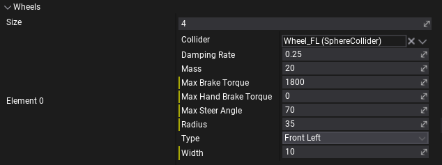
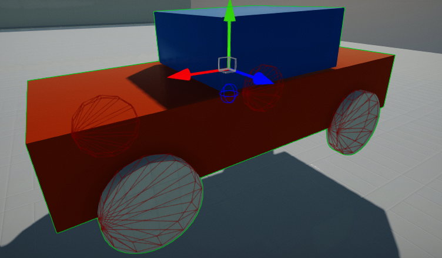
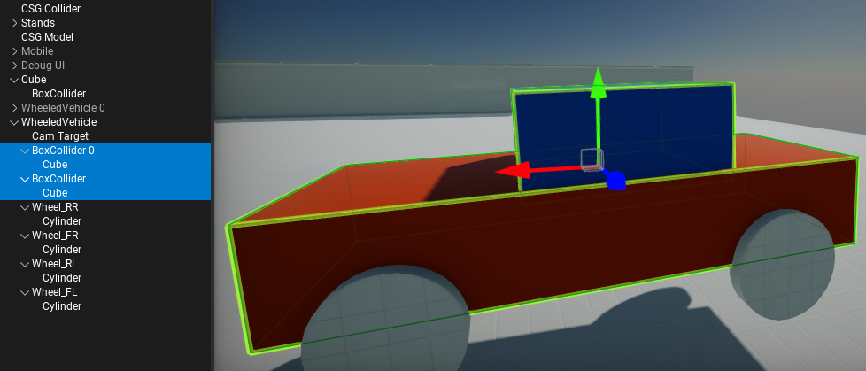

# Vehicles


Flax supports creation of physical-based vehicles such as cars and boats based on the [RigidBody](rigid-bodies.md) and [Colliders](colliders/index.md). This documentation section explains certain aspects in this topic.

## Wheeled Vehicle

**Wheeled Vehicle** is a car vehicle that uses wheels. It's built on top of the RigidBody with collider representing its chassis shape and wheels.

### Properties


To configure car driving experience use properties grouped under **Engine**, **Differential**, and **Gearbox** categories. See tooltips for the property labels to learn more about each setting and it's units.

Additionally, you can specify **Drive Type**, **Use Reverse As Brake** and other RigidBody properties including vehicle **Mass** and **Center Of Mass Offset**.

### Wheels



To describe vehicle wheels confgiuration **Wheels** array contains a list of per-wheel properties. Ensure to link proper **Collider** and define wheel **Type**. Each wheel is described as cylinder shape (radius, width) that should be approximation of the wheel collider dimensions. Each wheel can use steering by adjusting **Max Steer Angle**. Wheels can also use brakes and handbrakes (use appropeate properties to define torques).

### Scripting

Vehicles contain extensive API to access them from code. If you modify car properties like engine or gearbox configuration ensure to call `Setup()` method after. It will rebuild the vehicle and reset its state.

Vehicle input control:
* `SetThrottle(float value)`
* `SetSteering(float value)`
* `SetBrake(float value)`
* `SetHandbrake(float value)`
* `ClearInput()`

Vehicle state access:
* `float GetForwardSpeed()`
* `float GetSidewaysSpeed()`
* `float GetEngineRotationSpeed()`
* `int GetCurrentGear()` / `void SetCurrentGear(int value)`
* `int GetTargetGear()` / `void SetTargetGear(int value)`
* `void GetWheelState(int index, out WheelState result)`

Wheel state properties:
* `bool IsInAir`
* `PhysicsColliderActor TireContactCollider`
* `Vector3 TireContactPoint`
* `Vector3 TireContactNormal`
* `float TireFriction`

When creating complex vehicles (eg. based on Animated Model) you can query wheel colliders state and wheels or engine state to control the skinned vehicle body (eg. rotate wheel bones in Anim Graph).

### Technical details

Vehicles are using *PhysX Vehicles SDK* for driving, suspension and car components simulation (gearbox, engine, clutch, suspension, differential). Many of the exposed properties can be precesly configured to enhance the driving model per-vehicle. Maximum amount of wheels used per-vehicle is 20.

To learn more about vehicle physical simulation see related documentation [here](https://gameworksdocs.nvidia.com/PhysX/4.0/documentation/PhysXGuide/Manual/Vehicles.html).

For selected wheels vehicles the wheels are drawing on red and center of mass location is drawn as blue wire sphere.



### How to setup a car?

1) Create new **Wheeled Vehicle** actor (default options are configured for generic 4 wheel car)


2) Add mesh to visualize car body (model or skinned model)

3) Add collider for car body physical collision (convex mesh or set of primitive shapes - triangle meshes are not supported) - as children to vehicle


4) Add wheel colliders (eg. sphere colliders) - as children to vehicle and setup them in **Wheels** list


5) Setup wheels to be on a separate [layer](../editor/game-settings/layers-and-tags-settings.md) than car body and disable collisions between them in [Physics Settings](physics-settings.md)


6) Add script to control car - you can use the script below and set camera, car and camera target (camera target is root of camera rotation).
```cs
using System;
using System.Runtime.ConstrainedExecution;
using FlaxEngine;

public class CarScript : Script
{
    public WheeledVehicle Car;
    public Actor CameraTarget;
    public Camera Camera;

    public float CameraSmoothing = 20.0f;

    public bool UseMouse = true;
    public float CameraDistance = 700.0f;

    private float _pitch = 10.0f;
    private float _yaw = 90.0f;
    private float _horizontal;
    private float _vertical;

    /// <summary>
    /// Adds the movement and rotation to the camera (as input).
    /// </summary>
    /// <param name="horizontal">The horizontal input.</param>
    /// <param name="vertical">The vertical input.</param>
    /// <param name="pitch">The pitch rotation input.</param>
    /// <param name="yaw">The yaw rotation input.</param>
    public void AddMovementRotation(float horizontal, float vertical, float pitch, float yaw)
    {
        _pitch += pitch;
        _yaw += yaw;
        _horizontal += horizontal;
        _vertical += vertical;
    }

    public override void OnUpdate()
    {
        if (UseMouse)
        {
            // Cursor
            Screen.CursorVisible = false;
            Screen.CursorLock = CursorLockMode.Locked;

            // Mouse
            Vector2 mouseDelta = new Vector2(Input.GetAxis("Mouse X"), Input.GetAxis("Mouse Y"));
            _pitch = Mathf.Clamp(_pitch + mouseDelta.Y, -88, 88);
            _yaw += mouseDelta.X;
        }
    }

    public override void OnFixedUpdate()
    {
        // Update camera
        var camTrans = Camera.Transform;
        var camFactor = Mathf.Saturate(CameraSmoothing * Time.DeltaTime);
        CameraTarget.LocalOrientation = Quaternion.Lerp(CameraTarget.LocalOrientation, Quaternion.Euler(_pitch, _yaw, 0), camFactor);
        //CameraTarget.LocalOrientation = Quaternion.Euler(pitch, yaw, 0);
        camTrans.Translation = Vector3.Lerp(camTrans.Translation, CameraTarget.Position + CameraTarget.Direction * -CameraDistance, camFactor);
        camTrans.Orientation = CameraTarget.Orientation;
        Camera.Transform = camTrans;

        var inputH = Input.GetAxis("Horizontal") + _horizontal;
        var inputV = Input.GetAxis("Vertical") + _vertical;
        _horizontal = 0;
        _vertical = 0;

        var velocity = new Vector3(inputH, 0.0f, inputV);
        velocity.Normalize();
        //velocity = CameraTarget.Transform.TransformDirection(velocity);

        Car.SetThrottle(velocity.Z);
        Car.SetSteering(velocity.X);
        Car.SetHandbrake(Input.GetAction("Handbrake") ? 1.0f : 0.0f);
    }
}
```

7) Play & Test
