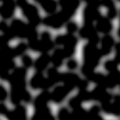
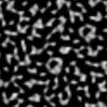
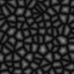
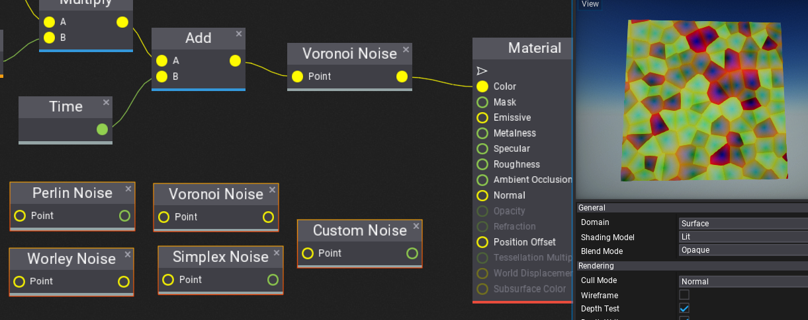

# Noise

Flax contains various utilities for sampling different noise functions such as:

| **Noise** | **Preview** |
|-------|------|
| Perlin |  |
| Simplex |  |
| Worley |  |
| Voronoi |  |
| Custom |  |

Those can be accessed via scripting `FlaxEngine.Utilities.Noise` static class and used to enrich procedurally generated worlds and content.

## Noise in Materials/Particles



All visual graphs (materials, particles, animations) can sample noise functions both on CPU and GPU to enrich the content. All noise functions return normalized results in the range 0-1. Some of them return more noise components, such as Voronoi Noise where `X=minDistToCell`, `Y=randomColor`, `Z=minEdgeDistance`. Depending on the context only one or even all components can be used. Follow the tooltip with documentation for every node.

## Noise preview control

Below is a sample code for custom UI Control that can be added to the scene for debugging or testing different noise types visually. Simply create `UI Canvas`, add `UI Control` to it, set control type to `NoisePreview`, and use `NoiseType` with `NoiseScale` properties to analyze noises.

```cs
public class NoisePreview : ContainerControl
{
    private GPUTexture _tempTexture;
    private byte[] _data;
    private Noises _noise = Noises.None;
    private float _scale;

    public enum Noises
    {
        [HideInEditor]
        None,
        Perlin,
        Simplex,
        Voronoi,
        Worley,
        Custom,
    }

    /// <summary>
    /// Noise to preview.
    /// </summary>
    public Noises NoiseType = Noises.Perlin;

    /// <summary>
    /// Noise scale.
    /// </summary>
    [Limit(0.001f)]
    public float NoiseScale = 10.0f;

    /// <inheritdoc />
    public NoisePreview()
    {
        Size = new Float2(64);
    }

    /// <inheritdoc />
    public override void DrawSelf()
    {
        base.DrawSelf();

        if (!_tempTexture)
        {
            // Create new GPU texture
            var texture = new GPUTexture();
            _tempTexture = texture;
            var desc = GPUTextureDescription.New2D(64, 64, PixelFormat.R8G8B8A8_UNorm, GPUTextureFlags.ShaderResource);
            if (texture.Init(ref desc))
                return;
        }

        if (_noise != NoiseType || _scale != NoiseScale)
        {
            // Update noise texture
            _noise = NoiseType;
            _scale = NoiseScale;
            UpdateTexture();
        }

        // Draw noise texture
        Render2D.DrawTexture(_tempTexture, new Rectangle(Float2.Zero, Size));
    }

    /// <inheritdoc />
    public override void OnDestroy()
    {
        // Ensure to cleanup resources
        _tempTexture?.ReleaseGPU();
        FlaxEngine.Object.Destroy(ref _tempTexture);

        base.OnDestroy();
    }

    private unsafe void UpdateTexture()
    {
        var desc = _tempTexture.Description;
        var size = desc.Width * desc.Height * PixelFormatExtensions.SizeInBytes(desc.Format);
        if (_data == null || _data.Length != size)
            _data = new byte[size];
        fixed (byte* dataPtr = _data)
        {
            // Generate pixels data
            Float2 uv;
            var colorsPtr = (Color32*)dataPtr;
            for (int y = 0; y < desc.Height; y++)
            {
                uv.Y = (float)y / desc.Height * _scale;
                for (int x = 0; x < desc.Width; x++)
                {
                    uv.X = (float)x / desc.Width * _scale;

                    // Sample noise at uv location
                    var noise = Vector3.Zero;
                    switch (_noise)
                    {
                    case Noises.Perlin:
                        noise = new Vector3(FlaxEngine.Utilities.Noise.PerlinNoise(uv));
                        break;
                    case Noises.Simplex:
                        noise = new Vector3(FlaxEngine.Utilities.Noise.SimplexNoise(uv));
                        break;
                    case Noises.Voronoi:
                        noise = FlaxEngine.Utilities.Noise.VoronoiNoise(uv);
                        break;
                    case Noises.Worley:
                        noise = new Vector3(FlaxEngine.Utilities.Noise.WorleyNoise(uv), 0.0f);
                        break;
                    case Noises.Custom:
                        noise = new Vector3(FlaxEngine.Utilities.Noise.CustomNoise(new Float3(uv, 0.0f)));
                        break;
                    }

                    colorsPtr[y * desc.Width + x] = (Color32)(Color)noise;
                }
            }

            // Update texture data on a GPU (send data)
            uint rowPitch = (uint)size / (uint)desc.Height;
            uint slicePitch = (uint)size;
            GPUDevice.Instance.MainContext.UpdateTexture(_tempTexture, 0, 0, new IntPtr(dataPtr), rowPitch, slicePitch);
            _tempTexture.ResidentMipLevels = 1; // Mark mip-map as available (required for standard textures only - other than render textures)
        }
    }
}
```
