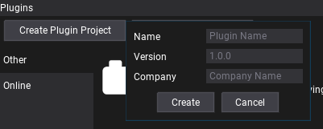

# Plugin Project

Flax supports the concept of plugin projects. A plugin project is a separate Flax project that can be referenced  from a game project and distributed as a plugin. Flax supports these references between nested projects. This concept is used by default in game projects by referencing the engine project. In this documentation section, you will learn how to reference and use the plugin project in your game project.

## Automated Creation

> [!Important]
> Internet access is required for the first plugin project created using this tool.

Open the Plugin Window **Tools -> Plugins**.


Click the create plugin project button and fill out the name, version, and company of the plugin project.


Click the submit button.

Restart the editor for the changes to take effect.

## Automated Git Cloning

> [!Important]
> Internet access and Git are required for this tool.

Open the Plugin Window **Tools -> Plugins**.


Click the clone plugin project button and enter the Git address of the plugin project. Entering a name is optional and will only rename the folder that contains the plugin project, otherwise the repository name will be used.


Click the submit button.

Restart the editor for the changes to take effect.

## Manual Creation

Create a new project and add it to your existing **project workspace subdirectory**. For instance, place it in the `Plugin/<plugin_name>` folder. You can also use an [example plugin](https://github.com/FlaxEngine/ExamplePlugin) project to do this.

It is imperitive that you rename plugin project files as the default name of "Game" cannot be used or it will conflict with the primary project name in global context during build (if left with default name of "Game"). To rename the plugin project, you will need to first open the .flaxproj in the editor and double-click a C# source file to generate the C# project files and necessary build scripts. Then rename the .flaxproj file, the .Net project files (.csproj), source files and class names replacing "Game" with your plugin name (e.g. "MyPlugin"). Once renaming is complete right-click the .flaxproj to "generate project script files" there should be no issues with generating script files, if there are then comb through the naming.

Next, add a **reference** from your game project to the added plugin project. Open **<project_name>.flaxproj** with a text editor and add reference to the plugin project:

```
    "References": [
        {
            "Name": "$(EnginePath)/Flax.flaxproj"
        },
        {
            "Name": "$(ProjectPath)/Plugins/MyPlugin/MyPlugin.flaxproj"
        }
    ],
```

As you can see, by using `$(ProjectPath)` followed by the local path you can reference the plugin project file directly. Then you can open the editor and use content and scripts from the plugin project in your game.

## Referencing the plugin

If you want to reference the types from referenced project code modules add reference in your game code module build script (in `Setup` function):

```cs
options.PrivateDependencies.Add("MyPlugin");
```

Plugin projects can also reference other projects but cross-solution references are not supported.


