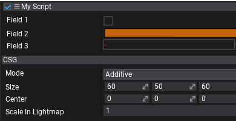

# Script properties and fields

Every script can contain various fields and properties. By default Flax shows all **public fields and properties** in the *Properties* window so user may edit them (undo/redo is supported).

# Script

## C#
[!code-csharp[Example1](code-examples/properties.cs)]

## C++
[!code-cpp[Example2](code-examples/properties.h)]

## Editor


# Attributes


## C#
If you want to **hide** a public property or a field simply use [HideInEditor](https://docs.flaxengine.com/api/FlaxEngine.HideInEditorAttribute.html) attribute.

```cs
[HideInEditor]
public float Field1 = 11;
```

If you want to **don't serialize** a public property or a field use [NoSerialize](https://docs.flaxengine.com/api/FlaxEngine.NoSerializeAttribute.html) attribute.

```cs
[NoSerialize]
public float Field1 = 11;
```

## C++
The C++ API supports the exact same attributes which can be used as shown.

```cpp
API_FIELD(Attributes="HideInEditor")
float Field1 = 11;
```

```cpp
API_FIELD(Attributes="NoSerialize")
float Field1 = 11;
```

To learn more about using attributes see this [page](attributes.md).

To learn more about scripts serialization see this [page](serialization/index.md).
