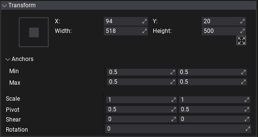
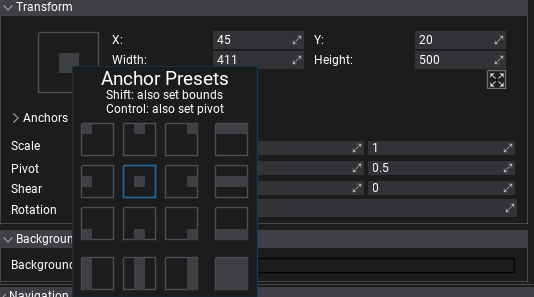

# Control Transform

Every GUI control contains a set of properties related to transforming the control within the parent container. Every control location can be assigned and fixed, or depend on the parent container controls dimensions. Use the properties group **Transform** when editing selected **UI Control** in the editor to adjust its appearance. All these options can also be modified at runtime from C# code.

## Anchor

The control has *anchor min* and *anchor max* properties which can be set manually or via the *Anchor Presets* editor. The control anchors are normalized (to range `0-1`) position in the parent control that the upper left and bottom right corners.

This can be used to dock control inside the parent container so control location/size can depend on parent container bounds.

Additional features:
* Hold *Shift* key to update control bounds to the certain anchor preset (eg. quickly fill the parent control area),
* Hold *Control* key to update the pivot point to the certain anchor preset (eg. to rotate the control around it).

> [!Tip]
> A small `X` button under the control's `Height` field can be used to toggle UI control resizing based on where the pivot is rather than just the top-left.

## Location

The location of the upper-left corner of the control relative to the upper-left corner of its container.

## Size

The size of the control bounds.

## Scale

The control scale parameter.

## Pivot

The control rotation pivot location in normalized control size. Point (0,0) is upper left corner, (0.5,0.5) is center, (1,1) is bottom left corner.

## Shear

The shear transform angles (x, y). Defined in degrees.

## Rotation

The control rotation angle (in degrees).

